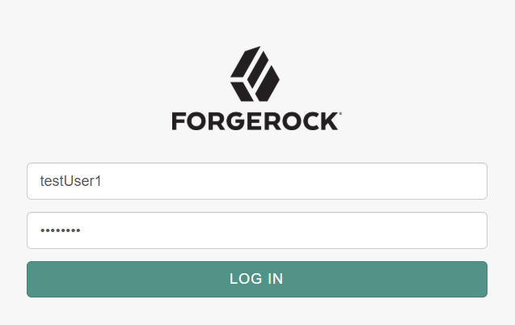
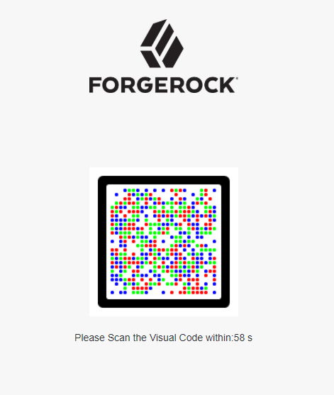
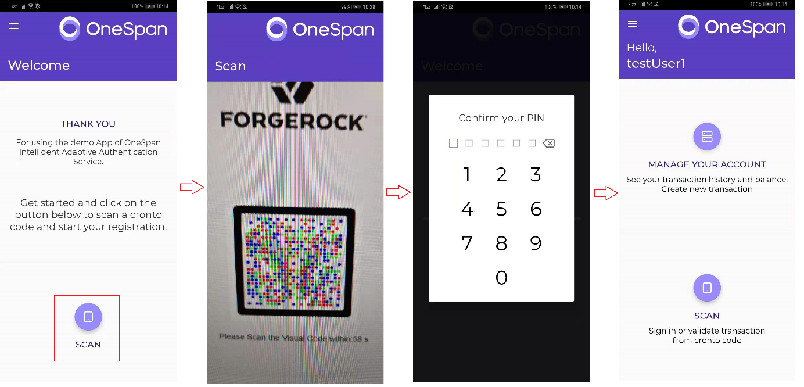
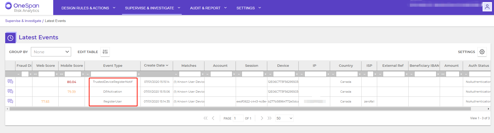

<!--
 * The contents of this file are subject to the terms of the Common Development and
 * Distribution License (the License). You may not use this file except in compliance with the
 * License.
 *
 * You can obtain a copy of the License at legal/CDDLv1.0.txt. See the License for the
 * specific language governing permission and limitations under the License.
 *
 * When distributing Covered Software, include this CDDL Header Notice in each file and include
 * the License file at legal/CDDLv1.0.txt. If applicable, add the following below the CDDL
 * Header, with the fields enclosed by brackets [] replaced by your own identifying
 * information: "Portions copyright [year] [name of copyright owner]".
 *
 * Copyright 2019 ForgeRock AS.
-->
# OneSpan IAA Auth Tree Nodes

OneSpan Intelligent Adaptive Authentication (IAA) secures your web and mobile applications by analyzing vast and disparate data acquired through user actions and events. Based on this analysis, OneSpan Adaptive Authentication dynamically assesses which authentication and/or transaction security measures are appropriate for each unique end user.

Watch this video to learn [how OneSpan intelligent adaptive authentication works](https://www.onespan.com/partners/forgerock).

## About OneSpan IAA

OneSpan Adaptive Authentication provides hosted solutions to test and build web and mobile applications for login and transaction signing flows.
Integration with OneSpan Adaptive Authentication is incredibly simple and extensible, as it will support future authentication technologies without the need to change anything in your integration code.
OneSpan intelligent Adaptive Authentication uses a 'trusted device' (e.g. a mobile phone using the OneSpan [Mobile Security Suite SDKs](http://community.onespan.com/products/mobile-security-suite/sdks) to provide strong multi-factor authentication whenever the risk associated with an action is high.
OneSpan Adaptive Authentication evaluates the risk related to an end-user request through vast data collected from the devices which is then scored with a sophisticated machine-learning engine. Depending on the risk, OneSpan Adaptive Authentication can dynamically adjust the end-user security requirements by requesting step-up authentication for higher risk transactions using various configurations of device-based, PIN-based, fingerprint-based, or face recognition-based authentication as needed to fully secure transactions.

## Installation

Download the current release [here](https://github.com/ForgeRock/OneSpan-Auth-Tree-Nodes/releases).

Copy the jar file to the "../web-container/webapps/openam/WEB-INF/lib" folder where AM is deployed, then restart the AM. The nodes will be available in the tree designer.

## Before You Begin

Below sections only give you a brief introduction to get started. For more detailed descriptions, refer to the [completed guide](./doc/OneSpan%20IAA%20Auth%20Tree%20Nodes%20Guide.pdf).

1. Create an OneSpan [Developer Community account](https://community.onespan.com/user/registration).

2. Once logged in the community portal, you'll be able to create an OneSpan [IAA Sandbox account](https://community.onespan.com/tid-sandbox-registration).
 
3. Set up a mobile application integrated with the [Mobile Security Suite](http://community.onespan.com/documentation/mobile-security-suite). As an easy start up, you can install the OneSpan IAA [Demo App](https://sdb.tid.onespan.cloud/devportal/InstallingVAASDemoApp) on your phone. 

4. Configure the [Intelligent Risk Management](https://sdb.tid.onespan.cloud/irm) (IRM) service. 

## Nodes Overview

The OneSpan IAA Auth Tree Nodes contains 1 Auxiliary Service, 8 nodes, and 3 demo nodes which only used for test purpose. 

## Auxiliary Service

The node provides a realm-specific service named "OneSpan Configuration", where allows you to specify the OneSpan IAA common configurations.

## Quick Start

Below sample trees help you to address the most common use cases. Before start, make sure you've followed below steps:

(1) Add the "OneSpan Configuration" service.

(2) Reproduce below sample trees using either of below two methods: 

-Manually create a new tree following the design and remain all the settings default. 

-Import the JSON files under the "/sample" folder through [AM Treetool](https://github.com/vscheuber/AM-treetool).

(3) Launch the Sample AAS Demo App in your mobile, agree the License Agreement and enable the required mobile permissions.

**1. OneSpan IAA User Register**

**2. OneSpan IAA Login Event**

**3. OneSpan IAA Transaction Event**

**4. OneSpan IAA Event Validation**

## Using Authentication

In this section, we will use the user register authentication for example and showcase you how the authentication nodes works in action.

To start off the authentication process, hit below link in your browser:

*https://{your_instance_url}/openam/XUI/?realm=/&service=OSIAAUserRegister#login*

You will be prompt to input the username and password. (Password should include at least one lowercase, one uppercase, one number, 8 digits in length, and doesn't include part of the username for any 3 characters)
 
 
 
Once the Risk Management service has accepted the user registration, the IAA service creates a Digipass user account and awaits a trusted device to activate the license with an activation token, which is rendered as a visual code.
  
  
  
Launch the AAS Demo App, click the "SCAN" button and use the camera to scan the above visual code. Once the code was detected, the app will prompt you to enter a 6 digits security pin twice.
After completion the registration process, the demo app will jump to the user page and the browser will be redirected to the success URL.
 
 
 
Log onto your IRM system and navigate to SUPERVISE & INVESTIGATE > Latest Events, you will find the user register process has been logged by the system with necessary information.
 

